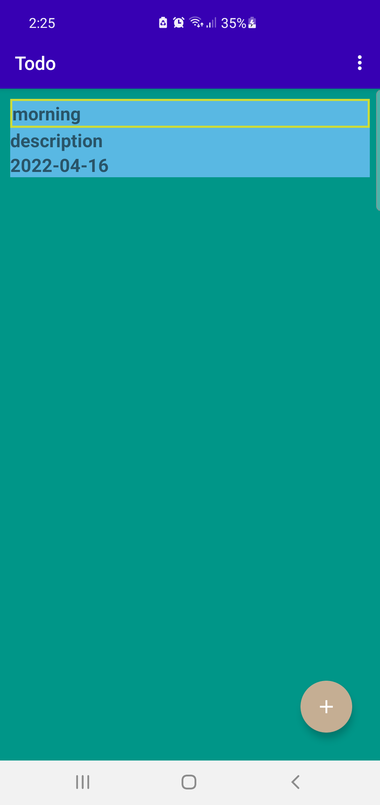
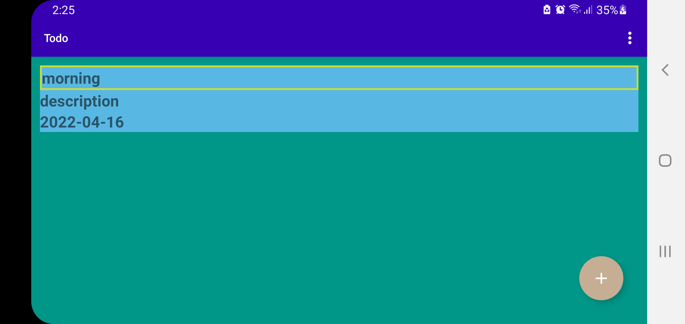
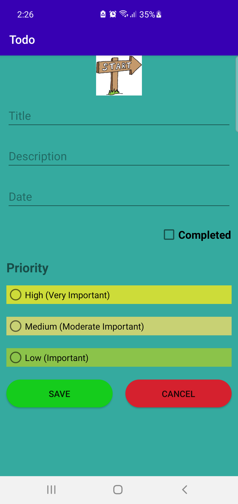
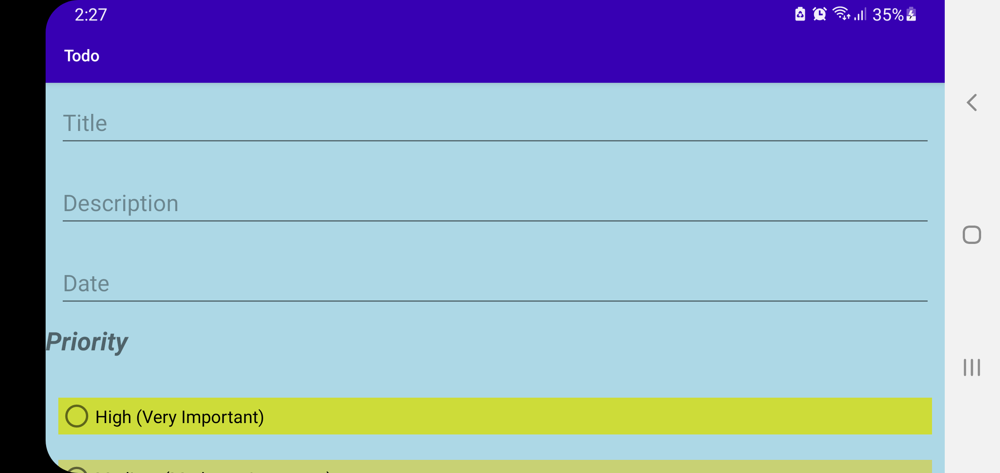

## Todo

### Todo Application

**This is the interface of the app when the app starts and here all the added items in the
todo list will be displayed and you can update or delete the listed tasks from here
**

**this is the landscape view of the interface**

**This is the interface of the app where we can add the list of our todo items where we have different
options from which we can select the task according to our impotance where the highly important task will
be appeared at first according to the date**

**this is the landscape view of the same page from which we cann add the item**

**this is the tutorial of the app**

---